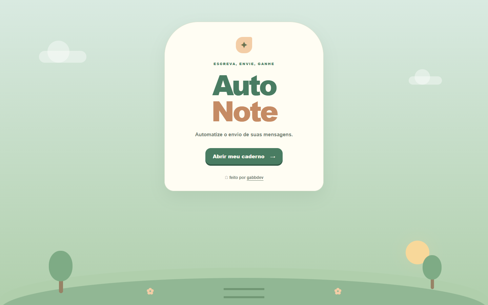
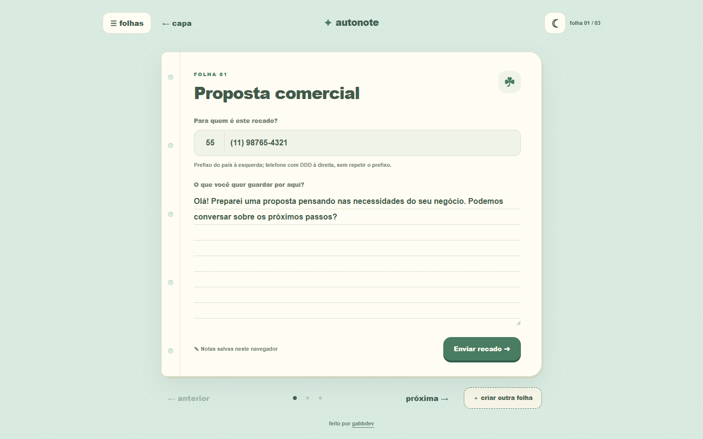
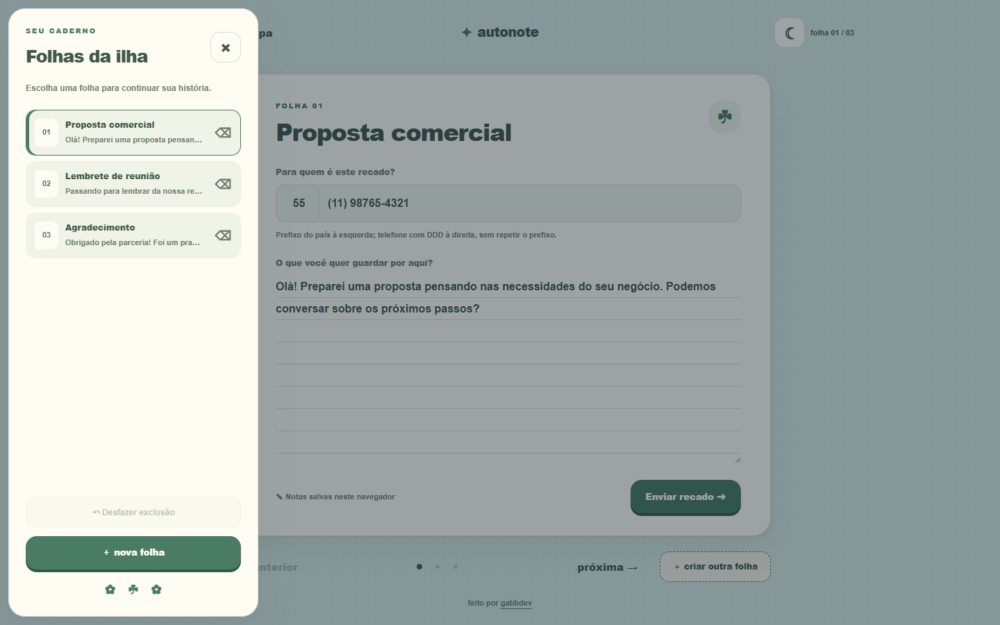
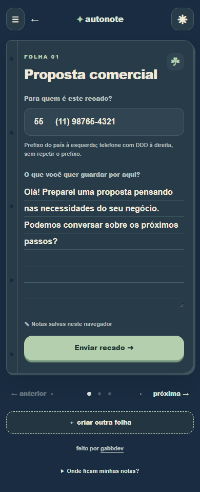

# AutoNote

O AutoNote organiza mensagens que você envia com frequência pelo WhatsApp. Ele serve para pequenos negócios, freelancers e equipes prepararem propostas, follow-ups, lembretes e recadinhos sem reescrever tudo a cada contato.

Cada folha guarda um telefone e uma mensagem. Ao clicar em **Enviar recado**, o AutoNote abre o WhatsApp com o conteúdo preenchido; o envio continua sob controle do usuário.

**Acesse:** [autonote-leaf.vercel.app](https://autonote-leaf.vercel.app/)

## Interface





| Menu de folhas | Modo noite no celular |
| --- | --- |
|  |  |

## O que ele faz

- Guarda telefone, prefixo internacional e mensagem em folhas separadas.
- Abre propostas, lembretes e recados diretamente no WhatsApp.
- Aplica máscara e validação aos telefones brasileiros.
- Aceita números internacionais.
- Permite criar, navegar, excluir e restaurar folhas.
- Mantém modo dia ou noite e funciona em celular e desktop.

Os dados ficam no `localStorage` do navegador. Não há conta, banco de dados ou sincronização. Limpar os dados do site apaga as notas desse navegador.

## Stack

- HTML5
- CSS3
- JavaScript puro
- Web Storage API (`localStorage`)
- API de links do WhatsApp (`wa.me`)
- Vercel para hospedagem

O projeto não usa framework, backend ou etapa de build.

## Rodando localmente

Clone ou baixe o repositório e abra o `index.html` no navegador. Para servir por HTTP, use qualquer servidor estático de sua preferência.

```bash
cd AutoNote
npx serve .
```

## Estrutura

```text
AutoNote/
├── assets/screenshots/
├── index.html
├── style.css
├── script.js
├── favicon.svg
├── favicon-32.png
├── apple-touch-icon.png
├── LICENSE
└── README.md
```

## Forks e uso

Forks, modificações e uso pessoal ou comercial são permitidos pela licença MIT. Ao redistribuir ou publicar uma versão derivada:

- mantenha o aviso de copyright e uma cópia da licença MIT;
- atribua os créditos a **Gabriel Douglas (gabbdev)**;
- indique quais mudanças foram feitas no fork.

O crédito pode apontar para [gabbdev.vercel.app](https://gabbdev.vercel.app/).

## Autor

Criado por [Gabriel Douglas — gabbdev](https://gabbdev.vercel.app/).

Leia a licença completa em [LICENSE](LICENSE).

> WhatsApp é uma marca de seus respectivos proprietários. O AutoNote não possui vínculo oficial com a plataforma.
